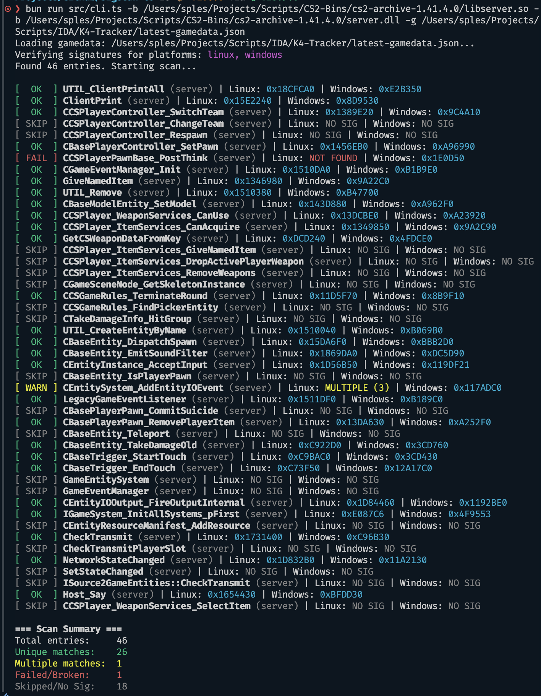

<a name="readme-top"></a>

<!-- BADGES -->
<div align="center">


</div>

<!-- PROJECT TITLE -->
<br />
<div align="center">
  <h1 align="center">sigscan-ts</h1>
  <p align="center">
    High-performance binary signature scanner and gamedata verifier
    <br />
    <strong>Zero runtime dependencies • Hybrid Buffer.indexOf prefix optimization • Fully Type-Safe • Auto relocatable signatures</strong>
    <br />
    <br />
    <a href="#installation"><strong>Get Started »</strong></a>
    ·
    <a href="https://github.com/K4ryuu/sigscan-ts/tree/main/examples">View Examples</a>
  </p>
</div>

## About The Project

Hey! I built this because I was working on a few game server modding tools and got tired of copy-pasting raw C++ signature scanning algorithms or relying on slow, outdated JavaScript libraries.

This is a modern, high-performance binary signature scanner. It runs on Node.js and Bun with no runtime dependencies whatsoever.

## Why this package is special

- **Zero runtime dependencies** - All dependencies are strictly for development and compilation. Check the `package.json` for yourself.
- **Hybrid search engine** - Rather than scanning byte-by-byte, it parses your signature to find the longest continuous prefix, performs a native C++ `indexOf` search, and then verifies wildcards around candidates. See the benchmark table below.
- **Extremely forgiving parser** - Copy signatures directly from Cheat Engine, IDA Pro, x64dbg, or C-style arrays (`{ 0x48, 0x8b, 0xc4, ?? }`). It handles spaces, dots, commas, raw hex strings, and escaped sequences out of the box.
- **Built-in CLI & Gamedata Verifier** - Scan single signatures or batch-verify entire `gamedata.json` files (supporting both CounterStrikeSharp and SwiftlyS2 formats) against server binaries in seconds.

## Performance

Benchmarked on a 100 MB random buffer with 3 planted signatures (Apple M2 Pro, Bun 1.3).

| Pattern type | Example | Time | vs naive loop |
|---|---|---|---|
| No wildcards | `DE AD BE EF CA FE BA BE` | ~8.5 ms | **~15x faster** |
| Wildcards (prefix-opt) | `DE AD ?? EF CA ?? BA BE` | ~9.4 ms | **~13x faster** |
| Fragmented wildcards | `?? AD ?? EF ?? FE ?? BE` | ~12.7 ms | **~10x faster** |
| `scan()` with `fast: true` | any | ~4.3 ms | **~30x faster** |
| Naive JS loop (baseline) | — | ~128 ms | 1x |

Run it yourself: `bun run bench`

<p align="right">(<a href="#readme-top">back to top</a>)</p>

## Installation

```bash
npm install sigscan-ts
pnpm add sigscan-ts
bun add sigscan-ts
```

<p align="right">(<a href="#readme-top">back to top</a>)</p>

## Quick example

Here is a quick example of a one-off pattern scan:

```typescript
import { readFileSync } from "fs";
import { scan, PatternScanner } from "sigscan-ts";

const buffer = readFileSync("libserver.so");

// 1. One-off quick scan
const result = scan(buffer, "48 8B C4 ? 53 ?? 90");
if (result.found) {
  console.log(`Found pattern at ${result.offsets.length} locations.`);
  console.log(`Primary offset: 0x${result.offsets[0].toString(16)}`);
  console.log(`Is the signature unique/reliable? ${result.reliable}`);
}

// 2. Reusable scanner (efficient for scanning multiple signatures)
const scanner = new PatternScanner(buffer);
const offsets = scanner.findPattern("55 48 89 E5");
console.log("Offsets found:", offsets);
```

<p align="right">(<a href="#readme-top">back to top</a>)</p>

## Command Line Interface (CLI)

If you install the package globally or run it via npx, you can use the built-in CLI:

```bash
# Scan a binary for a specific signature
sigscan-ts -b libserver.so -p "48 8B C4 ?? 53"

# Fast pattern scan that stops after proving a second match
sigscan-ts -b libserver.so -p "48 8B C4 ?? 53" --fast

# Verify an entire gamedata.json file against binaries
# (Supports folder paths or passing multiple files via multiple -b flags.
# Platform types and libraries are automatically detected!)
sigscan-ts -b /path/to/binaries_dir -g latest-gamedata.json
sigscan-ts -b libserver.so -b server.dll -g latest-gamedata.json
```

Here is a preview of the batch-verification mode running on both Windows and Linux binaries side-by-side:



<p align="right">(<a href="#readme-top">back to top</a>)</p>

## Supported Pattern Formats

The parser automatically detects and handles almost any copy-pasted pattern style:

- **IDA Pro**: `"48 8B C4 ?? 53 ? 90"`
- **x64dbg**: `"48.8B.C4.??.53"` (Dot-separated)
- **Cheat Engine**: `"48 8b c4 ?? 53"`
- **C-style Array**: `"{ 0x48, 0x8b, 0xc4, ??, 0x53 }"`
- **Escaped Hex**: `"\x48 \x8B \xC4 ?? \x53"`
- **Raw Hex String**: `"488bc4??53"`

<p align="right">(<a href="#readme-top">back to top</a>)</p>

## For developers

If you want to contribute or build the library locally, please check out the [contributing guide](CONTRIBUTING.md).

<p align="right">(<a href="#readme-top">back to top</a>)</p>

## License

MIT - do whatever you want with it

---

## Credits

Built by [K4ryuu](https://github.com/K4ryuu)
